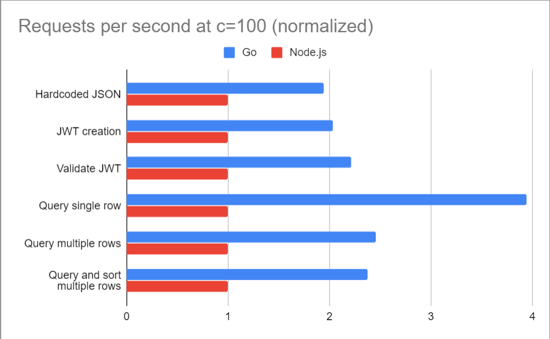
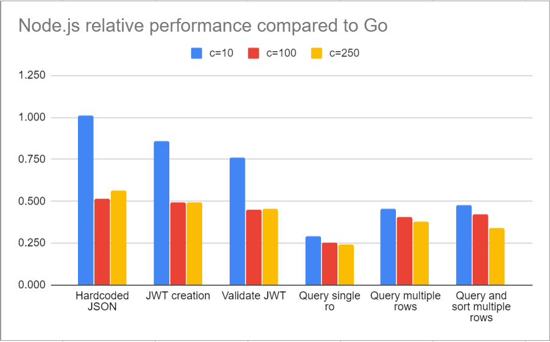
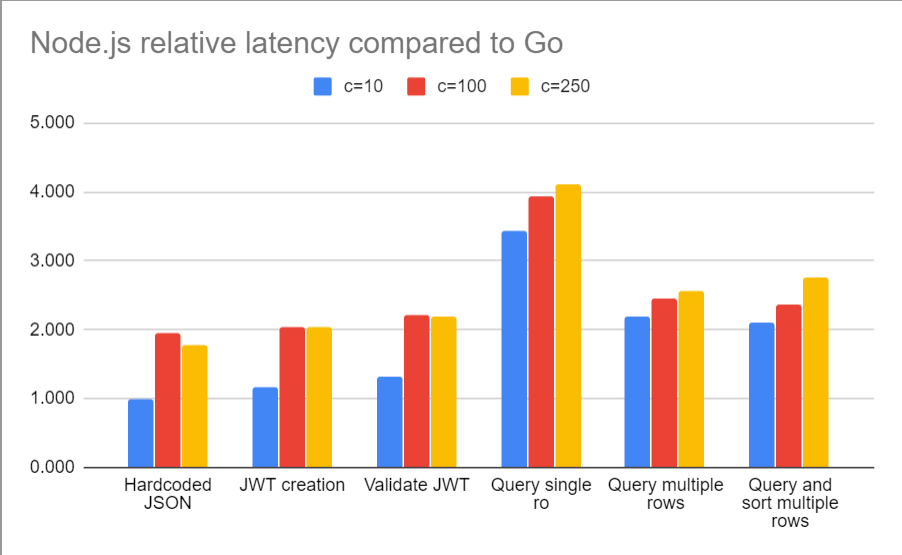

# Go vs Node.js REST backend benchmark 2020

**Go** v1.14 + **Fiber** v1.13.3 + **PostgreSQL** v12.3

\- vs -

**Node.js** v14.6.0 + **Fastify** v3.1.1 + **PostgreSQL** v12.3

## Results

  

  

  

|   |                              | Concurrency 10 | Avg. latency | Concurrency 100 | Avg. latency | Concurrency 250 | Avg. latency |
|---|------------------------------|----------------|--------------|-----------------|--------------|-----------------|--------------|
|   | Hardcoded JSON               | 100.9 %        | 99.0 %       | 51.4 %          | 196.0 %      | 56.3 %          | 177.6 %      |
|   | JWT creation                 | 86.0 %         | 116.4 %      | 49.3 %          | 202.9 %      | 49.2 %          | 202.9 %      |
|   | Validate JWT                 | 76.3 %         | 131.4 %      | 45.1 %          | 221.2 %      | 45.7 %          | 218.9 %      |
|   | Query single row             | 29.2 %         | 342.5 %      | 25.4 %          | 394.1 %      | 24.3 %          | 411.0 %      |
|   | Query multiple rows          | 45.4 %         | 220.1 %      | 40.6 %          | 244.4 %      | 37.7 %          | 255.7 %      |
|   | Query and sort mutliple rows | 47.6 %         | 209.5 %      | 42.1 %          | 236.0 %      | 34.3 %          | 275.1 %      |

## Raw measurements

|   |                                        | Concurrency 10 | Avg. latency | Concurrency 100 | Avg. latency | Concurrency 250 | Avg. latency |
|---|----------------------------------------|----------------|--------------|-----------------|--------------|-----------------|--------------|
|   | Hardcoded JSON - Node.js               | 34 866 req/s   | 0.285 ms     | 51 544 req/s    | 1.94 ms      | 53 514 req/s    | 4.67 ms      |
|   | Hardcoded JSON - Go                    | 34 552 req/s   | 0.288 ms     | 100 369 req/s   | 0.99 ms      | 94 970 req/s    | 2.63 ms      |
|   | JWT creation - Node.js                 | 28 611 req/s   | 0.348 ms     | 35 900 req/s    | 2.78 ms      | 36 113 req/s    | 6.92 ms      |
|   | JWT creation - Go                      | 33 256 req/s   | 0.299 ms     | 72 849 req/s    | 1.37 ms      | 73 355 req/s    | 3.41 ms      |
|   | Validate JWT - Node.js                 | 23 313 req/s   | 0.427 ms     | 27 408 req/s    | 3.65 ms      | 27 637 req/s    | 9.04 ms      |
|   | Validate JWT - Go                      | 30 570 req/s   | 0.325 ms     | 60 710 req/s    | 1.65 ms      | 60 518 req/s    | 4.13 ms      |
|   | Query single row - Node.js             |  6 148 req/s   | 1.62  ms     |  6 260 req/s    | 15.96 ms     |  5 913 req/s    | 42.21 ms     |
|   | Query single row - Go                  | 21 062 req/s   | 0.473 ms     | 24 651 req/s    | 4.05 ms      | 24 336 req/s    | 10.27 ms     |
|   | Query multiple rows - Node.js          |    352 req/s   | 28.37 ms     |    319 req/s    | 308 ms       |    285 req/s    | 836 ms       |
|   | Query multiple rows - Go               |    775 req/s   | 12.89 ms     |    785 req/s    | 126 ms       |    755 req/s    | 327 ms       |
|   | Query and sort mutliple rows - Node.js |    324 req/s   | 30.78 ms     |    300 req/s    | 328 ms       |    241 req/s    | 960 ms       |
|   | Query and sort multiple rows - Go      |    680 req/s   | 14.69 ms     |    713 req/s    | 139 ms       |    703 req/s    | 349 ms       |

## Test environment

- Bare metal PC with i5-3570 CPU @ 3.40GHz
- OS: Debian 10 (buster)
- Running Docker containers (JS and Go backend + Postgres v12)
- Measurements over Gigabit LAN from a different PC using `bombardier`.

